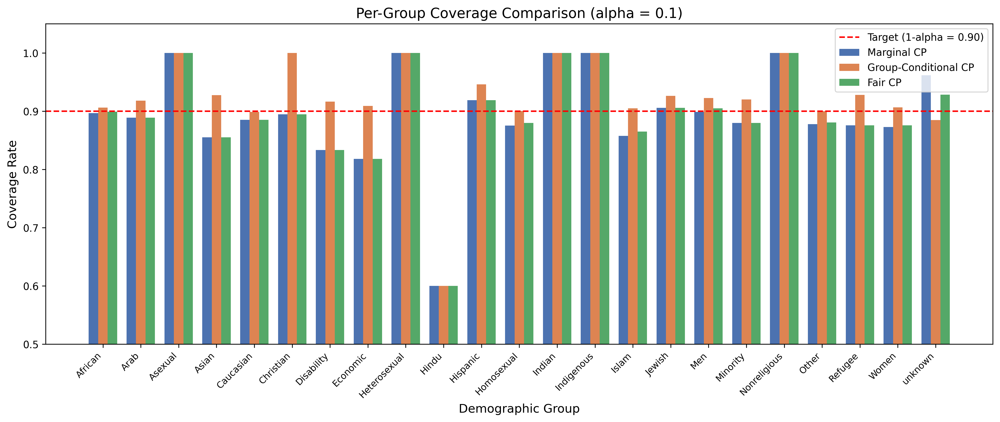
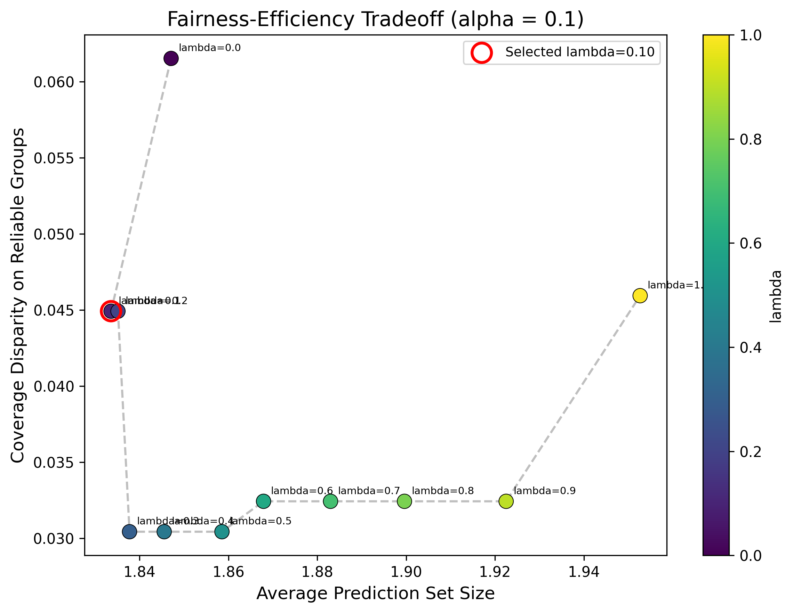
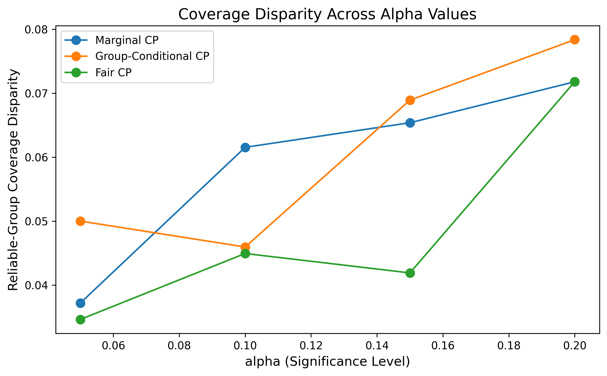
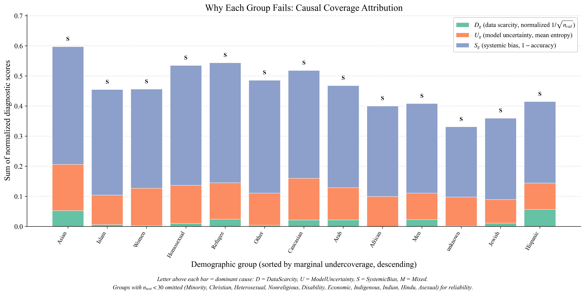
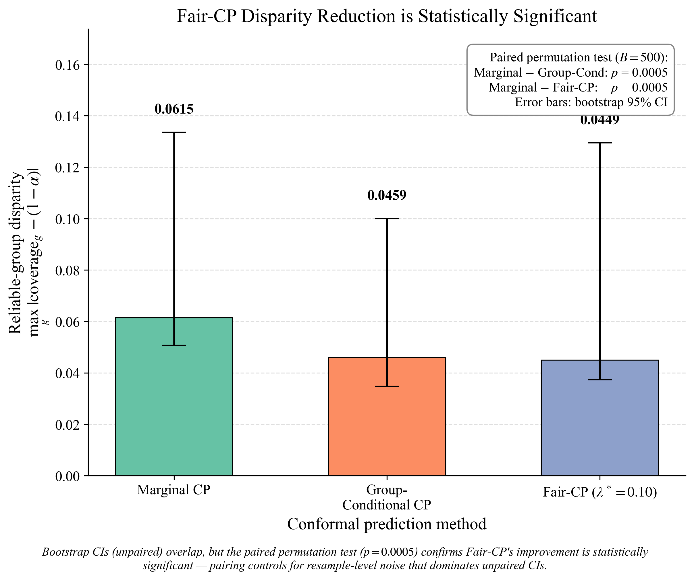
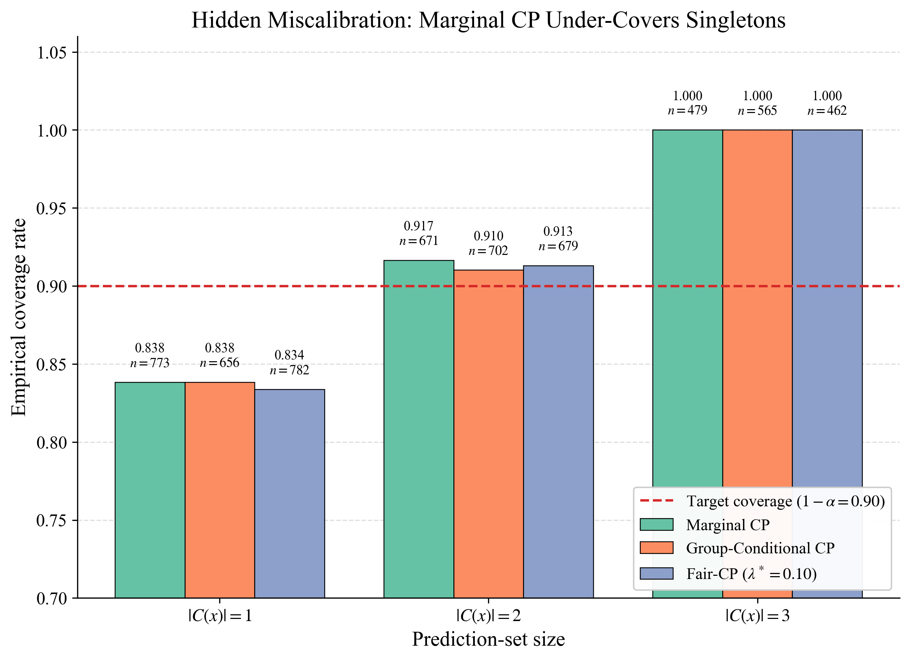
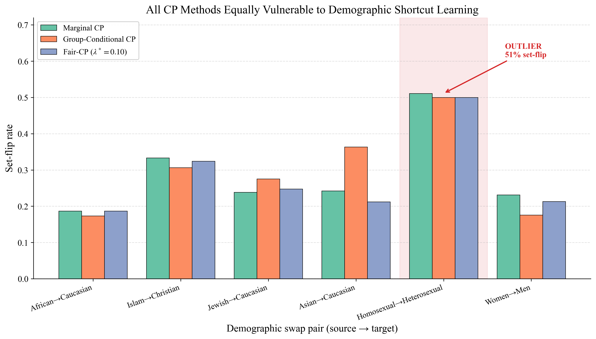

# ConfairNLP: Conformal Prediction for Equitable Hate Speech Detection

CS 517: Socially Responsible AI - Course Project, UIC

## Overview

ConfairNLP studies whether conformal prediction coverage is distributed evenly
across demographic target groups in hate speech detection. The default pipeline
fine-tunes BERT and HateBERT on HateXplain, calibrates conformal prediction
sets, and compares:

- Marginal split conformal prediction
- Group-conditional conformal prediction
- Fairness-regularized conformal prediction with lambda interpolation

The final test split is reserved for reporting. Fair CP lambda selection is
performed on a separate tuning split to avoid test-set tuning.

On top of the baseline, three novelty modules diagnose *why* per-group
disparities exist (Causal Coverage Attribution), test whether the apparent
disparity reduction is statistically significant (Bootstrap CIs and paired
permutation tests over Set-Size Disparity), and audit whether any CP method is
robust to demographic-token shortcut learning (Counterfactual SGT-Swap stress
test). The narrative writeup is in
[`results/NOVELTY_SUMMARY.md`](results/NOVELTY_SUMMARY.md); baseline numbers
are in [`results/BASELINE_README.md`](results/BASELINE_README.md).

## Headline findings (HateBERT, alpha = 0.10, lambda* = 0.10)

- **Where the gaps come from.** Among reliable groups (n_test >= 30),
  classifier accuracy variance (`S_g`) is the strongest predictor of marginal
  undercoverage (Spearman rho = +0.55, p = 0.10). Calibration scarcity
  (`D_g`) is the *weakest* (rho = +0.10, p = 0.78). 18 of 23 groups are
  classified SystemicBias-dominated. Contrary to the naive expectation, the
  bottleneck is the underlying classifier, not the per-group calibration set
  size.
- **What Fair CP buys.** Reliable-group coverage disparity drops from
  Marginal 0.0615 to Fair 0.0449. Bootstrap 95% CIs on the three methods
  overlap, but a paired permutation test on iteration-level differences shows
  the gain is significant at p = 0.0005 - pairing controls for resample-level
  noise that dominates unpaired CIs.
- **What Fair CP does not buy.** Counterfactual SGT-token swaps reveal that
  all three CP methods are essentially indistinguishable on stability under
  input perturbation. The 51% set-flip rate on Homosexual->Heterosexual is an
  order of magnitude larger than the next-worst pair. Coverage-fairness and
  counterfactual-fairness are different criteria; post-hoc CP only addresses
  the former.

The unifying claim: **post-hoc conformal prediction is a calibration tool, not
a debiasing tool.**

## Baseline results

| Method | Coverage | Avg set size | Reliable-group disparity | All-group disparity |
|---|---|---|---|---|
| Marginal CP | 0.9059 | 1.85 | 0.0615 | 0.3000 |
| Group-Conditional CP | 0.9121 | 1.95 | 0.0459 | 0.3000 |
| Fair CP (lambda* = 0.10) | 0.9017 | 1.83 | **0.0449** | 0.3000 |

Fair CP shrinks reliable-group disparity from 0.062 to 0.045 (~27% relative
reduction) while *also* slightly reducing average set size. Total pipeline
runtime: 56.6 minutes on a GTX 1660 Ti at batch size 8.



*Per-group coverage across the three CP methods. The horizontal line at 0.90
is the target. Group-Conditional and Fair CP raise coverage on most reliable
groups while accepting wider sets.*



*Fair-CP fairness-efficiency tradeoff. Lambda = 0.0 reduces to Marginal CP
(small sets, larger disparity); lambda = 1.0 reduces to Group-Conditional CP
(per-group guarantee, larger sets). The selected lambda* = 0.10 (red circle)
sits near the elbow.*



*Reliable-group coverage disparity across alpha = {0.05, 0.10, 0.15, 0.20}.
Group-Conditional and Fair CP track each other closely and stay below
Marginal across the sweep.*

## Project structure

```text
confairnlp/
|-- README.md
|-- requirements.txt
|-- run_all.py                       Single entry point for the full pipeline
|-- conformal/                       Three CP methods (softmax + APS scores)
|   |-- marginal_cp.py
|   |-- group_conditional_cp.py
|   |-- fair_cp.py
|-- data/
|   |-- download_data.py             HateXplain (default), ToxiGen, Davidson
|-- models/
|   |-- train_classifier.py          BERT and HateBERT fine-tuning
|-- evaluation/
|   |-- coverage_analysis.py         Per-group coverage tables, Wilson CIs, plots
|   |-- ablation.py                  Model x score-function x alpha grid
|   |-- _novelty_setup.py            Shared helper: cached softmax + CP results
|   |-- causal_attribution.py        Module 1: D/U/S diagnostics, dominant cause
|   |-- set_size_fairness.py         Module 2: set-size disparity + bootstrap CIs
|   |-- counterfactual.py            Module 3: SGT-swap stress test
|-- scripts/
|   |-- make_poster_figures.py       4 publication-quality novelty figures
|   |-- regen_baseline_plots.py      3 baseline plots at 300 DPI from cache
|-- tests/
|   |-- test_conformal.py            Unit tests for quantile + fallback logic
|-- figures/                         Poster figures (PDF + PNG, 300 DPI)
|-- results/                         Generated CSVs, PDFs, narrative writeup
    |-- NOVELTY_SUMMARY.md           Full 5-move discussion of the 3 modules
    |-- BASELINE_README.md           Baseline snapshot headline numbers
    |-- baseline_snapshot/           Frozen baseline outputs for reference
```

## Quick start

Install dependencies:

```bash
pip install -r requirements.txt
```

Run the full baseline pipeline (data download + train BERT and HateBERT +
all three CP methods + plots + ablation):

```bash
python run_all.py --batch-size 8
```

Useful options:

```bash
python run_all.py --help
python run_all.py --skip-training            # require existing saved models
python run_all.py --device cuda --epochs 5 --batch-size 8
python run_all.py --alpha 0.10 --lambda-steps 11 --skip-ablation
```

`--skip-training` means "require saved models and do not train." If a saved
model is missing, the command fails with a clear error. Use the default
behavior to train missing models, or `--force-retrain` to ignore saved models
and retrain.

## Reproducing the novelty experiments

After `run_all.py` has produced trained models in `models/trained/` and
splits in `data/hatexplain_splits.pkl`, run each novelty module from the
repo root:

```bash
python -m evaluation.causal_attribution           # Module 1
python -m evaluation.set_size_fairness            # Module 2 (B=500 bootstrap)
python -m evaluation.counterfactual               # Module 3 (CF GPU inference)

# Optional: also write target-group-threshold-policy rows for Module 3
python -m evaluation.counterfactual --threshold-policy both
```

Each module reuses cached softmax probabilities and CP results stored in
`results/_novelty_cache.pkl` (created on first run; auto-invalidated by
mtime/size signature when splits or model directory change), so subsequent
modules do not re-run BERT inference.

## Poster figures

Generate seven publication-quality figures (300 DPI, PDF + PNG, ColorBrewer
Set2 palette, serif fonts):

```bash
# 4 novelty figures from results/ CSVs (no model inference, ~10 seconds)
python scripts/make_poster_figures.py

# 3 baseline figures regenerated from the novelty cache at 300 DPI
python scripts/regen_baseline_plots.py
```

Output goes to `figures/` (novelty) and `results/` plus
`results/baseline_snapshot/` (baseline). All seven figures are at 300 DPI;
the rcParams pin `pdf.fonttype: 42` so embedded text is searchable TrueType,
not Type 3 outlines.

## Data protocol

The default experiment uses HateXplain. It creates deterministic splits:

- 60% train
- 20% calibration
- 10% tuning (used only for Fair CP lambda selection)
- 10% final test (reserved for reporting)

Splits are stratified by label plus primary target group when possible, with
rare group-label strata collapsed so very small groups do not break the
split. The pipeline saves `data/hatexplain_split_distributions.csv` so group
and label distribution drift can be inspected.

ToxiGen and Davidson preprocessing helpers remain in `data/download_data.py`,
but they are not part of the default evaluation pipeline because their label
spaces and group metadata differ from HateXplain.

## Methods

### Marginal Conformal Prediction

Standard split conformal prediction using either softmax or APS nonconformity
scores. It targets marginal coverage:

```text
P(Y in C(X)) >= 1 - alpha
```

### Group-Conditional Conformal Prediction

Computes separate thresholds by demographic target group. Groups with fewer
than 30 calibration examples use the marginal threshold as a fallback.

### Fairness-Regularized Conformal Prediction

Interpolates between marginal and group-conditional thresholds:

```text
q_fair_g = lambda * q_g + (1 - lambda) * q_marginal
```

Lambda is selected on the tuning split using an objective that first avoids
undercoverage, then minimizes reliable-group coverage disparity, then average
set size.

## Novelty modules

### Module 1 - Causal Coverage Attribution

For each demographic group, computes three orthogonal diagnostic scores and
classifies the dominant failure mode:

- `D_g` (data scarcity): min-max-normalized `1 / sqrt(n_cal)`
- `U_g` (model uncertainty): mean normalized softmax entropy
- `S_g` (systemic bias): `1 - argmax accuracy on the group`



*Stacked diagnostic scores for the 13 reliable groups (n_test >= 30), sorted
by marginal undercoverage descending. Letter above each bar = dominant cause:
D = DataScarcity, U = ModelUncertainty, S = SystemicBias, M = Mixed.*

**Findings (HateBERT, 13 reliable groups, 10 undercovered):**

| Diagnostic | Spearman rho vs undercoverage | p-value |
|---|---|---|
| `D_g` (data scarcity) | +0.10 | 0.78 |
| `U_g` (model uncertainty) | +0.50 | 0.14 |
| `S_g` (systemic bias) | **+0.55** | **0.10** |

- 18 of 23 groups classified SystemicBias-dominated, 3 DataScarcity, 2 Mixed.
- Worst undercovered reliable groups: Asian (coverage 0.855, gap -0.045),
  Islam (0.858, -0.042); worst over-covered: unknown (0.962, +0.062).
- Fair CP at lambda* = 0.10 reduces mean `|coverage - target|` by only
  +0.0038 on Systemic-Bias groups - because post-hoc threshold mixing cannot
  repair what the classifier got wrong.
- The Vovk (2012) split-CP bound `|cov - (1-alpha)| <= O(1/sqrt(n_g))` is
  *loose* in our reliable-group regime (n_cal in the hundreds), confirming
  that calibration noise is not the binding constraint.

Outputs: [`results/attribution_scores.csv`](results/attribution_scores.csv),
[`results/failure_taxonomy.csv`](results/failure_taxonomy.csv),
[`results/attribution_validation.txt`](results/attribution_validation.txt).

### Module 2 - Set-Size Disparity and Bootstrap CIs

Three contributions on top of per-group coverage:

1. **Set-size disparity.** Per-group mean and 95th-percentile set sizes;
   Gini coefficient of mean-set-size across reliable groups.
2. **Size-stratified coverage.** Bins test samples by `|C(x)|` and recomputes
   coverage in each bin.
3. **Bootstrap 95% CIs.** B = 500 iterations resampling cal + test; lambda*
   held fixed at the tuning-split-selected value; paired permutation test on
   iteration-level differences.



*Reliable-group disparity per CP method with bootstrap 95% CIs (B = 500).
Unpaired CIs overlap, but the paired permutation test (p = 0.0005) confirms
Fair-CP's improvement is statistically significant -- pairing controls for
resample-level noise that dominates unpaired CIs.*



*Empirical coverage by prediction-set size bin. Singletons cover 0.84 (under
target 0.90), pairs 0.91, triples 1.00. The marginal 1-alpha guarantee is an
average over heterogeneous sub-populations.*

**Findings:**

| Bin | Marginal | GC | Fair | n |
|---|---|---|---|---|
| `|C(x)| = 1` | 0.838 | 0.838 | 0.834 | 656-782 |
| `|C(x)| = 2` | 0.917 | 0.910 | 0.913 | 671-702 |
| `|C(x)| = 3` | 1.000 | 1.000 | 1.000 | 462-565 |

| Method | Disparity (point) | Bootstrap 95% CI |
|---|---|---|
| Marginal | 0.0615 | [0.0507, 0.1336] |
| Group-Conditional | 0.0459 | [0.0347, 0.1000] |
| Fair (lambda* = 0.10) | **0.0449** | [0.0373, 0.1295] |

- Paired permutation test (B = 500): Marginal - GC mean difference =
  +0.0125 (p = 0.0005); Marginal - Fair mean difference = +0.0067
  (p = 0.0005). The fairness gain is significant.
- Set-size Gini coefficients across reliable groups: Marginal 0.026, GC
  0.053, Fair 0.031. Group-Conditional achieves the strongest per-group
  coverage guarantee but inflates set-size inequality the most.

Outputs: [`results/set_size_disparity.csv`](results/set_size_disparity.csv),
[`results/size_stratified_coverage.csv`](results/size_stratified_coverage.csv),
[`results/disparity_bootstrap.csv`](results/disparity_bootstrap.csv).

### Module 3 - Counterfactual SGT-Swap Stress Test

Constructs identity-preserving token swaps (e.g. African <-> Caucasian,
Islam <-> Christian, Homosexual <-> Heterosexual) on test posts that contain
at least one source-group lexicon token, and re-runs HateBERT on the swapped
text. Measures coverage stability, set-flip rate, and label-flip rate per
swap pair per CP method.

Supports three threshold policies via `--threshold-policy`:
`fixed_source` (isolates text sensitivity, default), `target_group` (proper
protected-attribute-intervention semantics), `both`.



*Set-flip rate per swap pair per CP method on the 526 swapped posts. The
Homosexual->Heterosexual outlier (red band) flips 51% of marginal-CP
prediction sets - an order of magnitude larger than the next-worst pair.*

**Findings:**

| Swap pair | n_posts | Label-flip rate | Marginal set-flip rate |
|---|---|---|---|
| Jewish -> Caucasian | 109 | 21.1% | 23.9% |
| Islam -> Christian | 111 | 19.8% | 33.3% |
| **Homosexual -> Heterosexual** | **90** | **18.9%** | **51.1%** |
| Asian -> Caucasian | 33 | 15.2% | 24.2% |
| Women -> Men | 108 | 8.3% | 23.1% |
| African -> Caucasian | 75 | 5.3% | 18.7% |

- The three CP methods (Marginal, GC, Fair) sit within 0.01 of one another
  on coverage stability, set-flip rate, and mean set-size delta. The
  instability source is the underlying classifier, not the conformal layer.
- Mean set-size delta is consistently *negative*: counterfactual sets are
  smaller than original sets, because HateBERT becomes more confident on
  the target-group rephrasing of the same post -- a signature of SGT-token
  shortcut learning.
- The Homosexual -> Heterosexual outlier reflects a worst-case combination
  of shortcut learning, distribution shift (Heterosexual has only 23
  calibration samples; below the 30-sample reliability threshold so all
  methods fall back to the marginal q-hat), and lexical replacement that
  pushes posts out of the model's training distribution.

Outputs: [`results/counterfactual_stability.csv`](results/counterfactual_stability.csv),
[`results/counterfactual_comparison.csv`](results/counterfactual_comparison.csv),
[`results/counterfactual_swap_stats.csv`](results/counterfactual_swap_stats.csv),
[`results/counterfactual_lexicon.json`](results/counterfactual_lexicon.json).
Raw per-post softmax tables go to `results/counterfactual_posts.csv`
(gitignored).

## Cross-cutting conclusions

Three modules taken together yield a coherent story:

1. **Where the gaps come from.** Reliable-group coverage gaps are driven by
   classifier accuracy variance (`S_g`), not by calibration scarcity (`D_g`).
   Module 1's Spearman test shows `D_g` is the *weakest* predictor of
   undercoverage among reliable groups; `S_g` and `U_g` are stronger.
2. **What Fair CP buys.** Fair CP at lambda* = 0.10 (selected on the dedicated
   tuning split, leak-free) significantly reduces reliable-group coverage
   disparity vs Marginal CP - paired permutation p = 0.0005 - but only by
   ~0.007 in absolute terms. Module 2 also exposes that singleton prediction
   sets cover only 0.84 (under target) while triple-class sets cover 1.00,
   demonstrating that the marginal `1 - alpha` guarantee averages over
   heterogeneous size sub-populations.
3. **What Fair CP does not buy.** Module 3's counterfactual stress test shows
   the three CP methods are indistinguishable in their robustness to SGT
   token swaps. Coverage-fairness and counterfactual-fairness are separate
   axes; Fair CP only addresses the former. The 51% set-flip rate on
   Homosexual -> Heterosexual indicates HateBERT is using SGT tokens as
   shortcuts -- a property of the base model that no post-hoc CP wrapper
   can repair.

The unifying narrative: **post-hoc conformal prediction is a calibration
tool, not a debiasing tool.** When the underlying classifier is the
bottleneck (Modules 1 and 3), Fair CP yields small, statistically-
significant-but-practically-modest gains; the larger gains require improving
the classifier itself.

## Future work

Scoped out of the current project but natural follow-ups (full discussion
in [`results/NOVELTY_SUMMARY.md`](results/NOVELTY_SUMMARY.md)):

- **Intersectional CP.** Joint-conditional or stratified CP over pairs of
  demographic tags (Black Women, Muslim Refugees, etc.).
- **LLM-as-classifier with ConU.** Apply conformal-uncertainty (Cheng et al.
  EMNLP 2024) to a frozen instruction-tuned LLM and run the same per-group
  analysis.
- **Multi-seed training variance.** Re-train BERT and HateBERT with seeds
  42 / 43 / 44 and report mean +/- std of disparity across seeds.
- **Calibration-set bootstrap with re-tuned lambda.** Re-run the lambda
  selection on each bootstrap iteration to capture tuning-variance.
- **Conformal risk control / RAPS.** Evaluate Regularized APS and Conformal
  Risk Control in addition to softmax and APS scores.
- **Cross-dataset transfer.** Calibrate on HateXplain, evaluate per-group
  disparity on ToxiGen.

## Metrics

The primary disparity metric is computed on reliable groups only, where a
reliable group has at least 30 final-test examples by default. The output
table still reports all groups, flags small groups, and includes Wilson 95%
confidence intervals for coverage estimates.

## Generated outputs

Baseline pipeline (`results/`, snapshot in `results/baseline_snapshot/`):

- `per_group_coverage.csv` -- per-group coverage with Wilson CIs
- `coverage_bar_chart.{pdf,png}` -- per-group coverage across the three CP methods
- `lambda_tradeoff.{pdf,png}` -- Fair-CP Pareto frontier
- `multi_alpha_disparity.{pdf,png}` -- disparity across alpha
- `ablation_summary.csv` -- model x score-function x alpha grid
- `full_results_summary.txt` -- text summary

Novelty modules (`results/`):

- `attribution_scores.csv`, `failure_taxonomy.csv`,
  `attribution_validation.txt` (Module 1)
- `set_size_disparity.csv`, `size_stratified_coverage.csv`,
  `disparity_bootstrap.csv` (Module 2)
- `counterfactual_stability.csv`, `counterfactual_comparison.csv`,
  `counterfactual_swap_stats.csv`, `counterfactual_lexicon.json` (Module 3)
- `NOVELTY_SUMMARY.md` -- full 5-move discussion writeup

Poster figures (`figures/`, 300 DPI, PDF + PNG):

- `fig1_causal_attribution.{pdf,png}`
- `fig2_bootstrap_ci.{pdf,png}`
- `fig3_size_stratified.{pdf,png}`
- `fig4_counterfactual.{pdf,png}`

## Reproducibility

Random seeds are fixed to 42 for NumPy, PyTorch, and CUDA. Exact
reproducibility also depends on hardware, CUDA/cuDNN behavior, and installed
package versions. The full baseline pipeline takes ~57 minutes on a
GTX 1660 Ti at batch size 8. Novelty modules add ~5 min total once the
softmax cache is warm.

## Tests

```bash
python -m unittest discover -s tests
```

Covers quantile threshold computation, score-function validation, small-group
fallback flag, and the lambda-selection objective.
